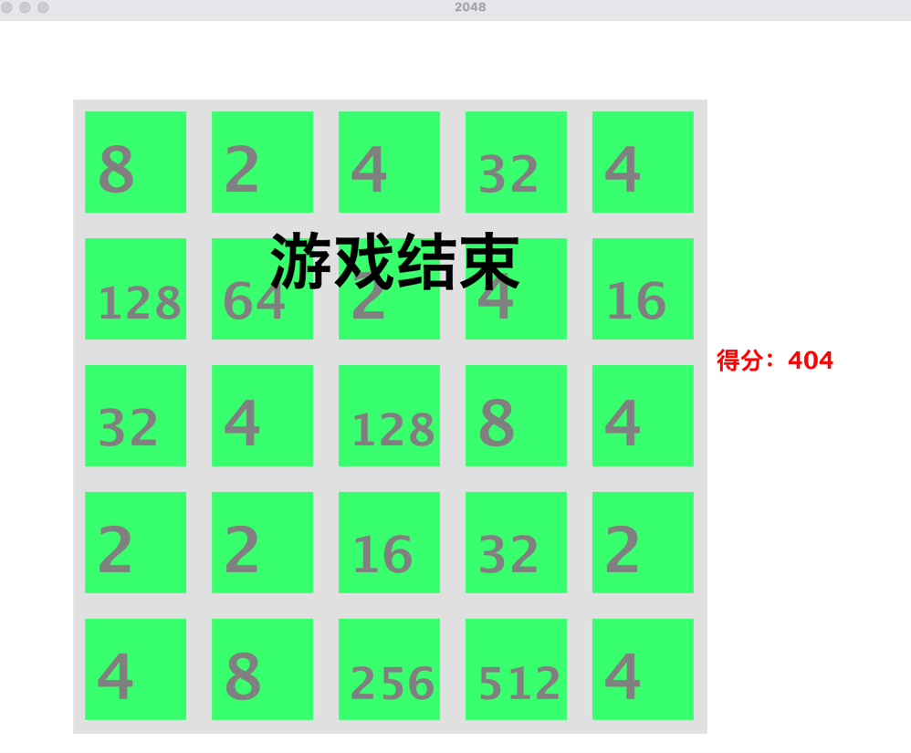

## 2048游戏

## 技术栈
java8，java-swing

## 运行
执行main方法，或maven打包为jar运行

## 逻辑
1. 初始化地图，初始化数组，随机生成两个方块
2. 监测到按键: 
   1. 执行move()移动，设置isMerge（是否能合并），isChange（是否改变位置）为false，复制当前map到oldMap（保存旧位置） 
   2. 移动、合并数组
   3. 判断地图是否发生合并，若没合并是否移动过
   4. 没移动的同时没有空位，就结束游戏
   5. 发生了合并就+1得分
   6. 生成新的方块
   7. 执行绘制地图方法

## 包含主要逻辑的控制台游戏
```java
/**
 * 控制台版，极简
 *
 * @author yongoe
 * @since 2023/4/10
 */
public class Main {
    public static void main(String[] args) {
        Scanner sc = new Scanner(System.in);
        Chunk chunk = new Chunk();
        chunk.createPoint();
        chunk.createPoint();
        chunk.print();
        while (true) {
            String input = sc.nextLine();
            switch (input) {
                case "w":
                    chunk.move(Direction.up);
                    break;
                case "a":
                    chunk.move(Direction.left);
                    break;
                case "s":
                    chunk.move(Direction.down);
                    break;
                case "d":
                    chunk.move(Direction.right);
                    break;
                default:
                    continue;
            }
            chunk.createPoint();
            System.out.println();
            System.out.println();
            System.out.println();
            chunk.print();
        }
    }
}
```
## 示例图片



#### c#编写的2048控制台游戏与代码(纪念版)
`g2048.zip`
VisualStudio启动 sln文件，运行项目
